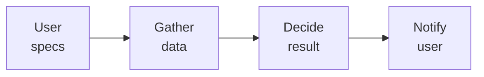

# Evap or AC?

Provide supplementary notification whether today is a good day to use an evaporative cooler or air conditioning based on user specification along with weather, air quality, and other data. Intended to simplify decision-making with evaporative coolers and air conditioners.

Disclaimer: this is intended for experimental use only and is not intended as a replacement for personal judgement.

## Workflow

## Background

### Evaporative Coolers

From <https://en.wikipedia.org/wiki/Evaporative_cooler>:
>An evaporative cooler (also evaporative air conditioner, swamp cooler, swamp box, desert cooler and wet air cooler) is a device that cools air through the evaporation of water.

There are certain conditions which are better than others for running an evaporative cooler. Generally, arid climates present the best use-cases. There are limitations to the effectiveness depending on the relative humidity, temperatures, and others.

Figure 6. on the following page depicts how relative humidity and temperature may achieve evaporative cooler supply air temperatures of a certain range: <https://basc.pnnl.gov/resource-guides/evaporative-cooling-systems#edit-group-description>

### Air Quality

From <https://en.wikipedia.org/wiki/Air_pollution>:
>Air pollution is the contamination of air due to the presence of substances in the atmosphere that are harmful to the health of humans and other living beings, or cause damage to the climate or to materials.

Evaporative coolers oftentimes do not include the use of filters to counteract low air quality conditions. Extreme examples of this include areas which may be indirectly impacted by forest fires (via smoke in the air), heavy ozone, or others. As a result, it may be non-ideal or harmful to run an evaporative cooler in very low air quality areas despite otherwise effective weather conditions.

## Data Sources

Given relative location:

- __Weather__
  - [NOAA Data](https://www.weather.gov/documentation/services-web-api)
    - Relative Humidity
    - Temperature High
- __Air Quality__
  - [EPA AQI](https://www.airnow.gov/aqi/aqi-basics/)
    - Computed air quality index number (lower is better)

## Decision-making

User provides the following specification:

- Relative location
- Acceptable temperature

Decision making is roughly described through the following (assumes all data gathered successfully as outlined above).

1. If AQI for location is above default threshold, return as `not a good day for evaporative cooler`.
1. If supply temperature possibility given relative humidity and temperature high for the day is above acceptable temperature provided by user, return as `not a good day for evaporative cooler`.
1. Else return as `good day for evaporative cooler`
